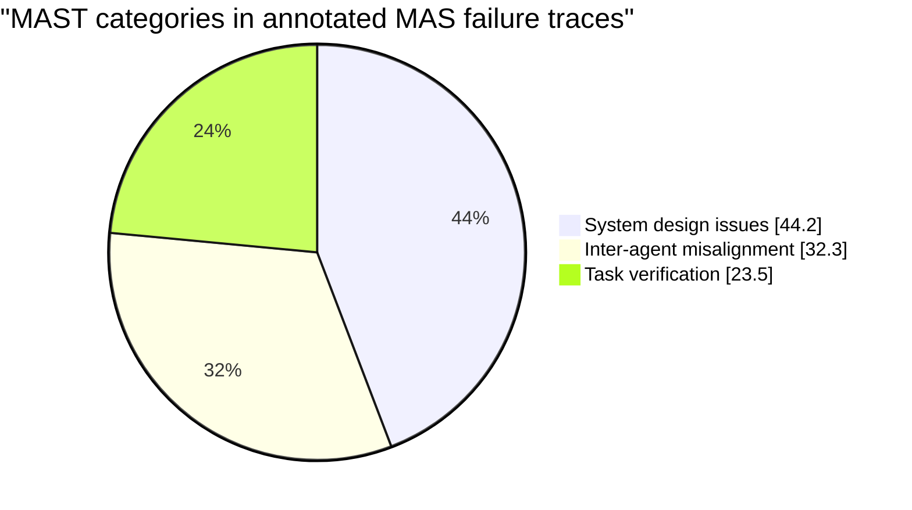
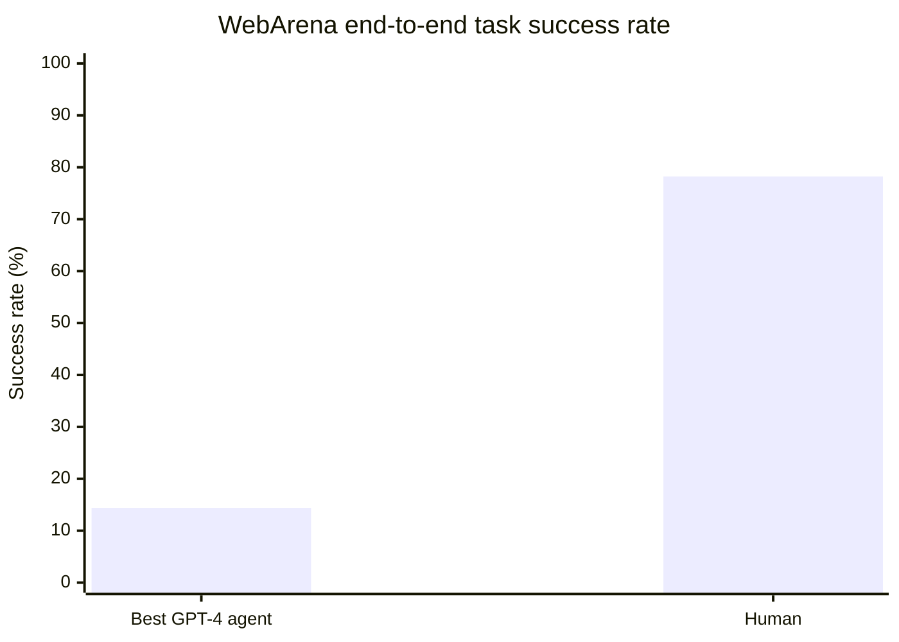

# Taxonomies of Failure Modes for Agentic AI Systems

> Note:
> This appendix predates the current schema alignment work. The operational
> LinkML taxonomy used by this repo now aligns its top-level dimensions to
> Shah et al. (2026), while this appendix remains as the broader narrative
> synthesis that informed earlier versions.

## Executive summary

Agentic AI refers to AI systems that do more than produce outputs: they *pursue goals* by iterating through observation, planning, and action in an environment (digital or physical), often with tools, memory, and sometimes multiple cooperating agents. citeturn20view0turn12view0 In practice, modern “agentic” systems frequently combine an LLM-based reasoning core with tool invocation and long-horizon control loops, which introduces failure patterns that differ from standalone LLM chat or conventional deterministic software. citeturn2view0

Across the current literature and incident-style evidence, four themes recur. First, autonomy and environmental “touch” amplify familiar model issues (hallucination, bias, misinterpretation) into higher-impact hazards because errors can propagate into downstream actions. citeturn12view0turn14view0turn2view0 Second, tool use and memory create new attack surfaces and new reliability problems (permission boundary violations, insecure output handling, prompt/knowledge/memory injection, state drift). citeturn0search2turn0search3turn11view4turn11view6 Third, multi-agent setups introduce coordination-specific failure modes (role/spec disobedience, information withholding, conversation resets, premature termination) with high observed prevalence in execution traces. citeturn15view0 Fourth, observability and recovery are not “nice-to-have”: multiple empirical sources emphasize weak error handling, limited logs, and unclear runtime signals as core contributors to diagnosing and preventing agent failures. citeturn2view0turn14view1turn11view5

This report synthesizes these findings into a practical failure-mode taxonomy organized into six categories—Specification & alignment; Planning & control; Tool & actuation; Memory/knowledge/state; Monitoring & recovery; Security & adversarial—and enumerates key subtypes. It explicitly includes the two user-provided example modes: **weak fallback (silent degradation)** and **choice overload (premature commitment)**.

The most consistently high-severity modes in real deployments are (a) instruction hijacking (prompt/indirect injection) and downstream tool misuse; (b) memory/knowledge poisoning that persists across episodes; (c) unauthorized or irreversible actuation; (d) “verification gaps” (no/incorrect checking, unreliable evaluators); and (e) silent degradation/observability failures that prevent human oversight from working. citeturn0search2turn0search3turn11view4turn15view0turn14view2turn2view0

## Definitions and scope

**Working definition of agentic AI.** Following the widely used framing in policy and industry, an AI agent (agentic AI) is an autonomous system that *senses/observes* and *acts* on its environment to achieve goals. citeturn20view0turn11view1 This report focuses on agentic systems with (at least) an iterative control loop and the ability to change environment state via tool calls, API actions, code execution, or physical instrumentation. citeturn14view0turn2view0

**Agent capabilities that matter for failure analysis.** A practical decomposition used in industry red-teaming distinguishes agentic capabilities that concentrate risk: autonomy, environment observation, environment interaction, memory, and collaboration. citeturn12view0 Agentic deployments also commonly vary by interaction pattern (user-driven vs event-driven), and by architecture (single-agent vs multi-agent; hierarchical vs collaborative). citeturn12view1

**What is in scope.**  
This report includes:
- Tool-using LLM agents and frameworks (e.g., “Reason+Act” loops where reasoning and actions interleave). citeturn7search0turn2view0  
- Multi-agent systems (MAS) where agents communicate, delegate, and jointly execute tasks. citeturn15view0turn12view1  
- Deployed or experimentally demonstrated scientific/biomedical agents (chemistry automation; bioinformatics agents that query biological databases). citeturn3search0turn3search1turn4search12turn4search29  
- Security and governance sources specifically addressing LLM/agent application risks. citeturn0search3turn6search1turn14view3turn5view0  

**What is out of scope (explicitly).**  
This report does *not* attempt a complete taxonomy of failures for all autonomous systems (robotics, classical planning, RL) independent of LLM-style agents; instead it focuses on agentic AI as currently deployed: LLM-centered with tools/memory/long-horizon workflows. citeturn2view0turn12view0

**Failure mode definition.**  
We use “failure mode” in the engineering sense: a recurring way a system can fail to perform its intended function such that effects and mitigations can be analyzed (an FMEA-style framing). citeturn6search3turn6search15 For agentic systems, a useful operational definition is “the agent does not achieve intended task objectives or violates constraints (safety, security, policy, or authorization).” citeturn15view0turn14view0

## Methodology for literature and incident review

This is a structured *narrative synthesis* (not a full systematic review), designed for a technical research audience (assumed because the user did not specify otherwise). Reporting follows PRISMA-style transparency norms for describing sources and inclusion logic, without claiming exhaustive coverage. citeturn6search2turn6search6

**Source families reviewed.**  
1) **Primary taxonomies and empirical studies of agent failures.**  
- Industry red-team taxonomy of agentic failure modes (safety vs security; novel vs amplified). citeturn11view1turn11view5turn11view6  
- Empirical multi-agent failure taxonomy with prevalence estimates from annotated execution traces (MAST). citeturn15view0turn15view1  
- Empirical software-engineering fault study analyzing 13,602 issues / PRs across 40 open-source agentic AI repositories, deriving fault/symptom/root-cause taxonomies and emphasizing cross-component fault propagation and observability gaps. citeturn2view0  

2) **Benchmarks and evaluations that surface agentic failure patterns (planning, recovery, robustness).**  
- Web navigation environment showing low end-to-end success for LLM agents vs humans, and attributing limitations to missing exploration and failure recovery. citeturn17view0turn17view1  
- Planning capability critiques and benchmarks indicating persistent planning weaknesses in LLMs on action/change reasoning tasks. citeturn8search4turn8search8turn8search32  

3) **Security standards and guidance for LLM/agent applications.**  
- OWASP Top 10 for LLM applications (prompt injection, insecure output handling, model DoS, supply chain, etc.). citeturn0search3turn0search12  
- Indirect prompt injection research demonstrating remote instruction injection via retrieved content and downstream impacts (e.g., data theft, tool/API manipulation). citeturn0search2turn0search5  
- Adversarial AI threat modeling resources (ATLAS). citeturn6search1turn6search5  

4) **Incident databases and governance/policy resources.**  
- Partnership on AI’s incident and failure-analysis resources, including the AI Incident Database (AIID) and a targeted report on real-time failure detection for agents. citeturn8search3turn14view0turn14view3  
- NIST human–AI interaction risk management guidance as a governance lens for oversight roles/responsibilities. citeturn9search35  
- Clinical deployment context via FDA guidance on Clinical Decision Support (CDS) software (relevant when agentic systems function as decision-support). citeturn5view0  

**Synthesis method.**  
The taxonomy below is synthesized by aligning failure modes across three complementary perspectives:  
- **Behavioral/task-level** failures (what went wrong in planning/execution). citeturn14view0turn15view0turn17view0  
- **Component/software-level** faults and propagation pathways (why it went wrong in the stack). citeturn2view0  
- **Safety/security governance** risks and adversarial surfaces (how it can be exploited, and how controls fail). citeturn11view5turn0search2turn0search3turn6search1  

**Severity/likelihood assessment approach.**  
Severity and likelihood ratings are qualitative and context-dependent, calibrated to: (a) autonomy level and environment influence; (b) reversibility of actions; and (c) stakes of the domain—consistent with guidance that failure detection and controls should scale with these factors. citeturn14view2turn14view3turn12view0

## Synthesized taxonomy of failure modes

The taxonomy is organized into six categories (each mode also has cross-cutting “dimension impacts”: safety, reliability, interpretability, alignment; influenced by autonomy level, environment complexity, and human oversight load). Category boundaries are sometimes fuzzy in practice because planning, tool use, and execution are not always separable in real agent traces. citeturn14view0turn2view0

Below, each failure mode includes: concise definition; typical triggers; representative examples (academic/real-world where available); root causes; detection signals/metrics; severity/likelihood; and prioritized mitigations (engineering, process, policy).

**Weak fallback (silent degradation)** *(Monitoring & recovery; user-provided example)*  
**Definition:** The agent enters a degraded operating mode (fallback model, reduced toolset, cached/stale retrieval, heuristic shortcut) without explicit signaling to users/monitors, producing plausible but lower-quality or unsafe outputs.  
**Typical triggers:** Tool/API failures, rate limits, token/compute constraints, partial outages, missing permissions, timeouts; “graceful degradation” paths that are not instrumented.  
**Examples:** Empirical fault analysis of agentic AI software highlights that failures “do not fail transparently” when weak error handling and limited logging obscure underlying causes—conditions that strongly enable silent degradation. citeturn2view0 A complementary safety-oriented view notes that backups/fail-safe operation require detection to function properly—implying that undetected fallback undermines the purpose of fallback. citeturn14view2  
**Root causes:** Broad exception catching; missing “degraded mode” state in telemetry; UI/UX that hides model/tool changes; lack of quality SLOs (success-only metrics).  
**Detection signals/metrics:** Sudden shifts in tool-call rate or success; changes in model/tool identifiers; spikes in “best-effort” responses; divergence between offline eval and online outcomes; increased variance across repeated runs (run-to-run reliability drops). citeturn2view0turn14view3  
**Severity/Likelihood:** Severity **Medium→Critical** (critical in clinical/industrial contexts); likelihood **Common** in production-grade systems with failover paths.  
**Mitigations (prioritized):**  
Engineering: explicit degraded-mode flagging; hard “stop-and-escalate” rules for high-stakes tasks; dual-channel outputs (answer + confidence/provenance); fallback-specific evals. citeturn14view3turn9search35  
Process: incident playbooks for degraded mode; chaos testing for partial outages; post-incident root-cause tracking (not just outcome logging). citeturn2view0turn14view3  
Policy: disclosure requirements for degraded operation in regulated workflows; auditability expectations tied to stakes and reversibility. citeturn14view3turn5view0  

**Choice overload (premature commitment)** *(Specification & planning; user-provided example)*  
**Definition:** Under large branching factor (many plausible plans/tools/interpretations), the agent commits early to a suboptimal option without sufficient exploration, leading to brittle trajectories and unrecoverable errors.  
**Typical triggers:** Ambiguous goals; high-dimensional action spaces; long-horizon tasks; missing “explore vs exploit” logic; budgeted reasoning causing early stopping.  
**Examples:** Tree-of-Thoughts was proposed specifically because token-by-token greedy inference “can fall short” when tasks require exploration/strategic lookahead and when early decisions are pivotal; ToT explicitly enables exploring multiple reasoning paths and backtracking to avoid premature commitment. citeturn7search1turn7search5 WebArena likewise hypothesizes that low agent success stems from missing capabilities such as “active exploration and failure recovery” in complex tasks. citeturn17view0turn17view1  
**Root causes:** Single-trajectory prompting; weak self-evaluation; no mechanism for backtracking; insufficient uncertainty modeling; search/verification not integrated into control loop.  
**Detection signals/metrics:** Low “plan diversity” (single plan generated); high regret (frequent late re-plans); early tool lock-in; low sensitivity to new evidence; repeated failures on tasks with similar branching factor and long horizon. citeturn17view0turn7search1  
**Severity/Likelihood:** Severity **Medium→High**; likelihood **Common** in open-ended tool-rich tasks.  
**Mitigations:**  
Engineering: deliberative inference (ToT-like search), reject options for tool selection, explicit “explore budget,” and backtracking checkpoints. citeturn7search1turn7search3  
Process: ambiguity tests; eval sets with many plausible solution paths; stress tests on branching-factor growth. citeturn17view1  
Policy: require human confirmation when decision irreversibility is high (especially in clinical/industrial automation). citeturn14view2turn5view0  

**Goal/intent mismatch** *(Specification & alignment)*  
**Definition:** The agent’s internal objective differs from the user’s true intent (misinterprets “what success means”), producing a plan that is locally coherent but globally wrong.  
**Typical triggers:** Vague prompts; missing domain constraints; shorthand language; hidden user preferences; conflicting goals among stakeholders.  
**Examples:** A failure-detection report lists “plan inconsistent with user intent” as a primary planning failure mode for agents, emphasizing it as a live operational hazard. citeturn14view0turn14view3  
**Root causes:** Incomplete task specification; lack of clarification-seeking; misalignment between reward/heuristics and user goals; context window omissions.  
**Detection signals/metrics:** High clarification deficit (agent proceeds with low information); mismatch between requirement extraction and final actions; high rate of user corrections/undo actions; semanticdiff between stated intent and executed plan steps. citeturn15view0turn14view3  
**Severity/Likelihood:** Severity **Medium→Critical** depending on domain; likelihood **Common**, especially with higher autonomy. citeturn12view0turn14view2  
**Mitigations:**  
Engineering: structured intent elicitation; “fail-closed” when intent is underspecified; preference/constraint schemas; interactive planning with confirmations for irreversible steps. citeturn14view2turn12view1  
Process: user studies on intent expression; red-team ambiguous requirements; logs that preserve intent extraction steps (provenance). citeturn14view3turn2view0  
Policy: domain policy templates (clinical/industrial) specifying minimum user intent fields. citeturn5view0turn14view3  

**Constraint omission and policy noncompliance** *(Specification & governance)*  
**Definition:** The agent fails to model or enforce explicit constraints (tool permissions, safety policies, regulatory rules), generating plans that exceed authorized or acceptable boundaries.  
**Typical triggers:** Tools with vaguely specified interfaces; overlapping tool capabilities; missing permission checks; policy-as-text only (non-executable constraints).  
**Examples:** Agents commonly face “plan exceeds tool permissions or other constraints” and “executing actions beyond authorized boundaries,” and these are treated as core failure scenarios in real-time failure detection discussions. citeturn14view0turn14view3  
**Root causes:** Lack of executable policy layer; inadequate authorization integration; weak action gating; poor separation between untrusted content and instructions. citeturn0search2turn0search3  
**Detection signals/metrics:** Authorization denials; policy-violation flags; anomalous resource access patterns; “capability overreach” (tools used outside task needs). citeturn14view0turn0search3  
**Severity/Likelihood:** Severity **High→Critical**; likelihood **Uncommon→Common** depending on permissioning maturity.  
**Mitigations:**  
Engineering: least-privilege tool scopes; typed, capability-based tool APIs; policy engines that can block/require approval; sandboxing for code/IO. citeturn14view3turn0search3turn6search1  
Process: pre-deployment access reviews; scenario-based audits; compliance-driven evaluation. citeturn5view0turn9search35  
Policy: enforce audit logs and “chain of events” reporting expectations for high-risk use cases. citeturn14view3turn5view0  

**Insufficient planning and long-horizon brittleness** *(Planning & control)*  
**Definition:** The agent produces incomplete or fragile plans that fail under multi-step dependencies and real-world complexity, often without recovery.  
**Typical triggers:** Long-horizon tasks; dynamic environments; partial observability; multi-tool workflows; long context histories.  
**Examples:** WebArena reports only **14.41%** end-to-end task success for the best GPT-4-based agent versus **78.24%** for humans, and attributes limited performance to missing active exploration and failure recovery in complex tasks. citeturn17view0turn17view1 Planning benchmarks likewise find “dismal” performance in LLM planning/reasoning about action and change. citeturn8search4turn8search8turn8search32  
**Root causes:** Weak world models; no explicit state tracking; inability to represent preconditions/effects; insufficient tool feedback integration.  
**Detection signals/metrics:** High replanning frequency; increasing plan–execution divergence over time; failure clustering on dependency depth; rising “stuck” rates. citeturn14view0turn17view0  
**Severity/Likelihood:** Severity **Medium→High**; likelihood **Common** for complex environments.  
**Mitigations:**  
Engineering: structured planning representations; tool-grounded ReAct-style loops; checkpointing and rollback; explicit failure recovery policies. citeturn7search0turn17view0turn14view2  
Process: benchmark on long-horizon tasks (WebArena-like); repeated-run reliability evaluation; postmortems that analyze trajectory, not just outcome. citeturn17view0turn14view3  
Policy: prohibit full autonomy for irreversible actions without confirmation. citeturn14view2turn5view0  

**Premature termination and step repetition loops** *(Planning & control)*  
**Definition:** The agent stops early (declares done without meeting objective) or loops by repeating steps, consuming resources and sometimes causing repeated side effects.  
**Typical triggers:** Budget constraints; inconsistent termination conditions; weak progress metrics; tool errors that are misinterpreted as success.  
**Examples:** In MAST (multi-agent failure taxonomy), “step repetition” and “premature termination” are explicit failure modes, with reported prevalence across analyzed traces. citeturn15view0  
**Root causes:** No termination criteria; missing state deltas; reward/utility miscalibration; inadequate loop detection. citeturn2view0turn15view0  
**Detection signals/metrics:** Repeated identical tool calls; cyclic action sequences; unchanged environment state across steps; “done” claims without validator success. citeturn15view0turn17view0  
**Severity/Likelihood:** Severity **Low→High** (higher when actions have side effects); likelihood **Common** in brittle agent scaffolds.  
**Mitigations:**  
Engineering: loop detectors; hard caps on repeated actions; validator-gated completion; resource budgets with safe abort + escalation. citeturn15view0turn14view3  
Process: failure-mode tests with adversarial “near-complete” tasks; require evidence of completion. citeturn15view0turn17view0  
Policy: cost/latency governance; mandatory human review for repeated high-impact operations. citeturn14view2turn9search35  

**Reasoning–action mismatch** *(Planning & execution)*  
**Definition:** The agent’s stated reasoning/plan does not match its executed actions (e.g., claims to do X but does Y), reducing trust and increasing hazard.  
**Typical triggers:** Tool-call formatting errors; latent instruction overrides; hallucinated tool outputs; UI mismatch between plan and execution.  
**Examples:** MAST includes “Reasoning–Action Mismatch” as a distinct, observed failure mode in multi-agent traces. citeturn15view0  
**Root causes:** Tool interface mismatch; incomplete grounding between natural language and action schema; nondeterminism from LLM sampling; instrumentation gaps. citeturn2view0turn7search0  
**Detection signals/metrics:** Plan–execution divergence metric; semantic consistency checks between plan text and tool calls; audit-trail discrepancies. citeturn14view1turn11view2  
**Severity/Likelihood:** Severity **Medium→High**; likelihood **Uncommon→Common** depending on tool richness.  
**Mitigations:**  
Engineering: typed function calling; constrained decoding; “executable plans” (machine-checkable); trace-based monitors. citeturn0search3turn14view1  
Process: differential testing across seeds; require logged tool-call arguments and outcomes. citeturn2view0turn14view3  
Policy: audit requirements for regulated use (clinical, safety-critical). citeturn5view0turn14view3  

**Multi-agent coordination breakdown** *(Planning & coordination)*  
**Definition:** In MAS, agents fail to coordinate due to role/spec violations, ignored inputs, information withholding, or conversation state loss—leading to deadlocks, wrong outputs, or unsafe emergent behavior.  
**Typical triggers:** Ambiguous role definitions; conflicting agent incentives; missing shared memory protocols; long dialogues; weak arbitration.  
**Examples:** MAST organizes MAS failures into categories including “system design issues” and “inter-agent misalignment,” with concrete submodes such as disobeying role/task specifications, loss of conversation history, ignored input, and information withholding. citeturn15view0turn15view2 The same study reports overall failure rates between **41% and 86.7%** on evaluated open-source MAS across multiple tasks—underscoring reliability risk in current multi-agent designs. citeturn15view0  
**Root causes:** No shared ground truth; weak communication protocols; lack of consensus mechanisms; hidden state and poor observability in agent-to-agent exchanges. citeturn2view0turn14view1  
**Detection signals/metrics:** Inter-agent contradiction rate; clarification-request deficit; conversation resets; divergence in agent beliefs; consensus failure counters. citeturn15view0turn14view0  
**Severity/Likelihood:** Severity **Medium→Critical** (critical when agents can act); likelihood **Common** in MAS at current maturity. citeturn15view0turn12view1  
**Mitigations:**  
Engineering: explicit protocols (roles, turn-taking, arbitration); shared state with versioning; validators and a “supervisor” agent with authority-limited tools. citeturn12view1turn15view0  
Process: MAS-specific evaluations (trace analysis, staged failure injection); red-team emergent behaviors. citeturn15view1turn11view2  
Policy: require human oversight proportional to autonomy level; define accountability across agent boundaries. citeturn14view3turn9search35  

**Wrong tool selection and tool misuse** *(Tool & actuation)*  
**Definition:** The agent selects an inappropriate tool or misuses a correct tool (format/arguments/sequence errors), often cascading into incorrect or unsafe actions.  
**Typical triggers:** Overlapping tools; unclear tool descriptions; weak tool-choice training; partial observability (agent “guesses” parameters).  
**Examples:** Failure-detection guidance lists “selecting the wrong tool,” “misusing the tool,” and tools causing unintended side effects among core agent failure modes. citeturn14view0turn14view1 Work on tool selection improvements explicitly introduces a “Reject” option to mitigate tool misuse (decline tool calls when uncertain). citeturn7search11turn7search3  
**Root causes:** Contract mismatch between probabilistic generation and deterministic API schemas; integration failures and type/validation errors are dominant root-cause classes in large-scale fault analyses of agentic AI software. citeturn2view0turn14view0  
**Detection signals/metrics:** Schema validation errors; tool-call retry loops; argument out-of-range; tool-failure clustering by endpoint; rising “unknown” fields. citeturn14view0turn2view0  
**Severity/Likelihood:** Severity **Medium→Critical** depending on tool power; likelihood **Common**.  
**Mitigations:**  
Engineering: strict schemas + static checks; tool simulators; “reject / ask human” branch; least-privilege, capability-scoped tools. citeturn7search11turn14view3turn6search1  
Process: tool-contract tests; canary deployment on tool changes; benchmark tool-use under noise and distribution shift. citeturn2view0turn8search6  
Policy: require tool access justification and logging for sensitive tools (clinical, industrial controls). citeturn5view0turn14view3  

**Unsafe tool-output handling** *(Tool security; OWASP-style application risk)*  
**Definition:** The system treats tool outputs as trusted instructions or executable content (e.g., rendering HTML/JS, executing code, writing to files/DB) without sanitization and provenance checks, enabling injection-style exploits or downstream corruption.  
**Typical triggers:** “LLM output → executor” pipelines; retrieval-augmented browsing; code-writing agents; automated email/workflow actions.  
**Examples:** OWASP identifies insecure output handling as a top LLM-application risk, highlighting downstream execution and injection pathways. citeturn0search3 Indirect prompt injection work demonstrates the blurred line between data and instructions in LLM-integrated applications, enabling remote exploitation when retrieved content is treated instructionally. citeturn0search2turn0search5  
**Root causes:** Missing trust boundaries; unsafe templating; absent output encoding; no sandbox for code/commands.  
**Detection signals/metrics:** Detection of executable tokens/patterns in outputs; anomalous file writes or network calls; security scanning alerts; discrepancies between tool output provenance and used instructions. citeturn0search3turn14view1  
**Severity/Likelihood:** Severity **High→Critical**; likelihood **Uncommon→Common** (higher in browsing/code-execution agents).  
**Mitigations:**  
Engineering: sanitize/escape outputs; content-security policies; sandbox execution; explicit “data vs instruction” separators. citeturn0search3turn0search2  
Process: appsec threat modeling using OWASP/ATLAS; red-team tool chains. citeturn0search3turn6search1  
Policy: security review gates for any agent that can execute code or mutate critical assets. citeturn14view3turn6search1  

**Unauthorized actuation and permission boundary violations** *(Tool & environment interaction)*  
**Definition:** The agent performs actions beyond its authorized scope (data access, transactions, configuration changes), often due to weak auth integration or instruction hijacking.  
**Typical triggers:** Overbroad credentials; shared service accounts; missing action confirmation; insecure plugin/tool ecosystems.  
**Examples:** Execution failures explicitly include “executing actions beyond authorized boundaries,” and tool-use failures include “tool accesses resources beyond task needs.” citeturn14view0turn14view3  
**Root causes:** Poor identity/permission design; failure to enforce “need-to-know”; action gating treated as prompt text rather than enforced policy. citeturn6search1turn0search3  
**Detection signals/metrics:** Anomalous access patterns; privilege escalation indicators; policy-engine denials; high-entropy resource access (agent “roams”). citeturn14view0turn6search1  
**Severity/Likelihood:** Severity **Critical**; likelihood **Uncommon→Common** depending on privilege hygiene.  
**Mitigations:**  
Engineering: principle of least privilege; per-action authorization; escrowed credentials; irreversible-action confirmations; segmented environments. citeturn14view3turn6search1  
Process: access reviews; secrets-management; incident response drills for agent credentials. citeturn14view3turn6search1  
Policy: enforce audit logging and retention, especially in high-risk sectors. citeturn14view3turn5view0  

**Hallucination and fabricated evidence** *(Memory/knowledge; reliability; interpretability)*  
**Definition:** The agent generates incorrect factual content, invented citations, or fabricated intermediate “evidence,” which can mislead downstream reasoning and actions.  
**Typical triggers:** Open-domain queries without grounding; biomedical nomenclature; long-horizon summarization; citation generation.  
**Examples (bioinformatics/biomed):** A genomic benchmarking study reports extremely high hallucination/error rates in gene name conversion tasks for certain LLM settings (e.g., near-total error without web grounding in one reported configuration). citeturn4search0 In medical writing contexts, work proposes quantitative scoring of reference hallucinations because fabricated citations are a recurrent risk. citeturn4search2  
**Root causes:** Training-data gaps; confabulation under uncertainty; retrieval mismatch; lack of provenance tracking. citeturn4search8turn2view0  
**Detection signals/metrics:** Fact-checker disagreement; citation validity rate; knowledge-base consistency checks; strict provenance requirements (every claim must map to a retrieved source). citeturn4search2turn4search8  
**Severity/Likelihood:** Severity **Medium→Critical** (critical in clinical/biological decision support); likelihood **Common** without grounding. citeturn4search0turn5view0  
**Mitigations:**  
Engineering: retrieval-augmented verification; self-verification against authoritative databases (domain tools); abstention behavior; claim-level provenance. citeturn4search12turn4search1  
Process: grounded evaluation suites; domain expert review; restrict autonomous action when factual uncertainty is high. citeturn14view2turn5view0  
Policy: in clinical settings, ensure outputs remain reviewable and do not bypass professional judgment; align with CDS governance expectations. citeturn5view0turn9search5  

**Verification failure (no, incomplete, or incorrect verification)** *(Monitoring & recovery)*  
**Definition:** The agent fails to verify whether it achieved the goal, or performs incorrect verification (false-positive success), allowing errors to ship.  
**Typical triggers:** Lack of validators; reliance on the same model as both actor and judge; weak tests; missing ground truth.  
**Examples:** MAST includes “No or Incomplete Verification” and “Incorrect Verification” failure modes in its task verification category. citeturn15view0 In scientific-tool agents, ChemCrow reports that GPT-4 used as an evaluator could not reliably distinguish clearly wrong completions from correct agent outputs, illustrating verifier unreliability as a practical failure mode. citeturn3search1turn3search5  
**Root causes:** Single-model monoculture; evaluator bias; missing end-to-end checks; metric mis-specification. citeturn15view0turn3search1  
**Detection signals/metrics:** Disagreement among diverse verifiers; validator coverage gaps; mismatch between internal “success” and external ground truth; high false-pass rate. citeturn17view0turn15view0  
**Severity/Likelihood:** Severity **High** (because it converts errors into shipped actions); likelihood **Common** in early-stage agent stacks.  
**Mitigations:**  
Engineering: independent validators; multi-model or tool-based verification; executable checks (tests, invariants); avoid same-model judge without calibration. citeturn17view0turn3search1  
Process: evaluation of monitors themselves; repeated-run reliability tests; post-deployment audits. citeturn14view3turn17view0  
Policy: require verification evidence/trace retention in high-risk deployments. citeturn14view3turn5view0  

**Memory poisoning and persistent instruction corruption** *(Security × memory/state)*  
**Definition:** An adversary (or contaminated data stream) inserts malicious content into an agent’s memory/knowledge store so that future actions are manipulated when the memory is recalled.  
**Typical triggers:** RAG-based memories that accept writes; autonomous memorization; shared memory across agents; insufficient validation of stored content. citeturn11view4turn11view6turn12view0  
**Examples:** A detailed industry case study shows a memory-poisoning attack on an email assistant: baseline attack success **4/10 (40%)**, rising to **>80%** after modifying the system prompt to encourage memory checking before responses—demonstrating how procedural changes can *increase* exploit reliability. citeturn11view4turn11view5  
**Root causes:** Lack of semantic/contextual validation for stored memories; missing authorization checks on memory writes; treating memory as trusted. citeturn11view4turn11view5  
**Detection signals/metrics:** Untrusted memory-write events; anomalous retrieval contents; drift in behavior correlated with recalled memory items; “memory provenance” failures. citeturn11view4turn11view5  
**Severity/Likelihood:** Severity **Critical** for enterprise/clinical; likelihood **Uncommon→Common** depending on memory write controls. citeturn11view6turn14view3  
**Mitigations:**  
Engineering: authenticated memorization; trust boundaries between memory tiers; contextual validation before memory influences actions; user-visible memory inspection and remediation. citeturn11view5turn11view4  
Process: red-team memory channels; continuous monitoring of memory mutations. citeturn11view4turn14view1  
Policy: treat agent memory as a security-sensitive asset (access controls, retention, incident response). citeturn6search1turn14view3  

**Prompt injection and indirect instruction hijacking** *(Security & adversarial surface)*  
**Definition:** Attackers manipulate the agent via crafted instructions in user input or in retrieved/third-party content (indirect injection), causing the agent to ignore original goals and controls.  
**Typical triggers:** Browsing/RAG; email/knowledge ingestion; insufficient separation of “data” and “instructions”; tools that fetch untrusted pages.  
**Examples:** Indirect prompt injection research demonstrates remote exploitation where prompts are injected into data likely to be retrieved, enabling effects such as manipulating tool/API calls and data theft. citeturn0search2turn0search5 OWASP ranks prompt injection as a top risk category for LLM applications. citeturn0search3turn0search12  
**Root causes:** Instruction/data boundary collapse; lack of content provenance; inadequate prompt/tool defenses; monitor models inheriting brittleness. citeturn0search2turn14view1  
**Detection signals/metrics:** Known attack pattern matches; anomalous instruction shifts; sudden goal drift; monitoring-model alerts (with caution about false negatives). citeturn14view1turn0search3  
**Severity/Likelihood:** Severity **High→Critical**; likelihood **Common** for browsing agents unless strongly sandboxed.  
**Mitigations:**  
Engineering: isolate untrusted content; enforce tool-call allowlists; deterministic policy checks; robust sandbox and output sanitization. citeturn0search3turn0search2turn14view1  
Process: continuous adversarial testing; threat modeling with OWASP/ATLAS categories. citeturn0search3turn6search1  
Policy: security review and monitoring requirements for any agent consuming third-party content. citeturn14view3turn6search1  

**State desynchronization and context loss** *(Memory/state; reliability)*  
**Definition:** The agent’s internal state (conversation history, task state, environment state assumptions) diverges from reality, leading to incorrect actions despite locally coherent reasoning.  
**Typical triggers:** Long sessions; tool outputs not incorporated; conversation resets; partial observability; concurrency.  
**Examples:** MAST explicitly includes “loss of conversation history” and “conversation reset” as failure modes in MAS traces. citeturn15view0 Component-level fault analysis also finds that failures frequently propagate across state management, memory-related symptoms, and other architectural boundaries, emphasizing state-handling fragility in agent stacks. citeturn2view0  
**Root causes:** Weak state modeling; token/context management defects; memory subsystem bugs; inconsistent serialization between steps. citeturn2view0turn15view0  
**Detection signals/metrics:** Inconsistencies between stored state and tool observations; replay divergence; sudden “amnesia” markers; increased corrective loops. citeturn15view0turn2view0  
**Severity/Likelihood:** Severity **Medium→High**; likelihood **Common** in long-horizon tasks. citeturn17view0turn15view0  
**Mitigations:**  
Engineering: explicit state machines; environment snapshots; idempotent actions; robust context compression with invariants; state versioning. citeturn2view0turn17view0  
Process: replay-based debugging; fault injection for context truncation and tool latency. citeturn2view0turn8search6  
Policy: higher oversight for event-driven agents that operate continuously. citeturn12view1turn14view2  

**Observability and provenance gaps** *(Interpretability; monitoring)*  
**Definition:** The system cannot reliably explain, audit, or reproduce why an action was taken (missing logs, unclear tool provenance, opaque monitor decisions), reducing accountability and impairing safety controls.  
**Typical triggers:** Rapidly evolving tool ecosystems; insufficient logging; multi-agent handoffs; privacy trade-offs in trace collection.  
**Examples:** Large-scale fault analysis characterizes an “observability crisis” in autonomous/agentic systems and notes that weak error handling and limited logging can obscure faults and amplify debugging difficulty. citeturn2view0 Industry guidance recommends unique identifiers and audit trails across agent components to attribute actions. citeturn11view2turn10view3 Failure-detection work stresses that incident reporting should be grounded in detailed logs and traces of agent actions, not only final outcomes. citeturn14view3turn14view1  
**Root causes:** Telemetry treated as optional; privacy constraints without alternative assurance; nonstandard trace formats; multi-agent attribution ambiguity. citeturn14view1turn2view0  
**Detection signals/metrics:** “Unknown cause” incident fraction; missing tool-call arguments/outcomes; low reproducibility on replay; high MTTR for agent issues. citeturn2view0turn14view3  
**Severity/Likelihood:** Severity **High** (because it disables oversight); likelihood **Common** for early deployments.  
**Mitigations:**  
Engineering: structured logging; trace schemas; component IDs; provenance tags for retrieved content; privacy-preserving monitoring architectures when needed. citeturn14view1turn11view2turn14view3  
Process: “monitor the monitors” evaluation; postmortems tied to traces; shared norms for agent system cards that include monitoring and detection evaluation. citeturn14view3turn14view1  
Policy: require auditability proportional to stakes (especially clinical/critical infrastructure). citeturn14view3turn5view0  

**Resource exhaustion and agent denial of service** *(Reliability & security)*  
**Definition:** The agent exhausts compute, tokens, tool quotas, or operational constraints, causing service disruption or unsafe partial execution.  
**Typical triggers:** Loops; large tool outputs; adversarial prompts designed to maximize cost; missing rate limits.  
**Examples:** OWASP lists “Model Denial of Service” as a key LLM application risk. citeturn0search3 Execution failures include exhausting operational constraints (e.g., inference token limits). citeturn14view0 Empirical fault work highlights “resource exhaustion beyond token counting” as a salient area requiring attention in agentic systems. citeturn2view0  
**Root causes:** No budget management; lack of termination criteria; unbounded tool retrieval; weak caching strategies. citeturn15view0turn2view0  
**Detection signals/metrics:** Token/time budget alerts; tool quota exhaustion; latency spikes; repeated failure-to-progress with rising cost. citeturn14view0turn0search3  
**Severity/Likelihood:** Severity **Medium→High** (higher when partial actions are harmful); likelihood **Common** without strong budget controls.  
**Mitigations:**  
Engineering: strict budgets and circuit breakers; progressive summarization; rate limits; bounded retrieval; safe abort semantics. citeturn0search3turn15view0turn14view3  
Process: adversarial cost testing; staged rollouts with cost SLOs. citeturn14view3turn8search6  
Policy: cost governance and abuse monitoring for publicly exposed agents. citeturn0search3turn6search1  

**Overreliance and automation bias in human oversight** *(Human oversight; safety/interpretability)*  
**Definition:** Human operators over-trust or under-trust the agent, accepting incorrect outputs or failing to intervene appropriately; agent behavior can also induce “rubber-stamping” via plausible outputs.  
**Typical triggers:** High-but-imperfect reliability; time pressure; interruptions; opaque reasoning; missing uncertainty cues.  
**Examples:** Classic human factors work identifies misuse/abuse of automation and the emergence of automation bias. citeturn9search4 Systematic reviews in clinical decision support contexts document automation bias and discuss its impact on vigilance and errors. citeturn9search5turn9search37 Agent governance guidance emphasizes defining human roles and responsibilities in human–AI interaction to manage these limitations. citeturn9search35  
**Root causes:** Poorly calibrated confidence cues; lack of explanation/provenance; organizational workflow pressure; insufficient training. citeturn9search5turn14view1  
**Detection signals/metrics:** Acceptance rate of agent suggestions; low rate of independent verification; correlation between agent confidence and human compliance; “override latency.” citeturn9search14turn9search5  
**Severity/Likelihood:** Severity **High** in clinical/safety-critical decision support; likelihood **Common** unless actively mitigated. citeturn5view0turn9search5  
**Mitigations:**  
Engineering: calibrated uncertainty, provenance, and “why this action” summaries; friction for irreversible actions; decision support that encourages verification. citeturn9search35turn14view2  
Process: training and simulation; periodic audits of reliance behavior; evaluate human–agent team outcomes, not just agent outcomes. citeturn9search2turn14view3  
Policy: mandate oversight and logging for high-risk systems; ensure staffing and workflow support for meaningful review. citeturn14view3turn5view0  

## Comparative artifacts

### Comparison table of failure modes

The table below compares primary modes (names align with the taxonomy above). Severity is qualitative (Low / Medium / High / Critical) under typical agentic conditions; it should be recalibrated to stakes and reversibility in the target deployment. citeturn14view2turn14view3

| Name | Category | Typical triggers | Detection signals / metrics | Prioritized mitigations (engineering / process / policy) | Severity |
|---|---|---|---|---|---|
| Weak fallback (silent degradation) | Monitoring & recovery | Partial outages; tool failures; token limits; rate limits | Model/tool ID shifts; tool-call drop; quality drift vs eval; variance spike | Explicit degraded-mode flags; fail-closed on high stakes / chaos tests / disclosure rules | High |
| Choice overload (premature commitment) | Spec & planning | High branching; ambiguity; budgeted reasoning | Low plan diversity; early tool lock-in; late replans | Deliberative search + backtracking; reject/ask-human / ambiguity tests / approval for irreversible steps | Medium–High |
| Goal/intent mismatch | Spec & alignment | Vague prompts; hidden preferences; shorthand | Low clarification rate; user corrections; plan–intent semanticdiff | Structured elicitation; confirmations / user studies / domain templates | High |
| Constraint omission / policy noncompliance | Spec & governance | Missing executable policies; unclear permissions | Authorization denials; policy flags; overbroad access | Least privilege + policy engine / access reviews / audit+retention requirements | Critical |
| Insufficient planning / long-horizon brittleness | Planning & control | Multi-step dependencies; dynamic environment | High replanning; stuck rate; dependency-depth failures | Structured planning + recovery loops / long-horizon benchmarks / autonomy limits | High |
| Premature termination / step repetition | Planning & control | Weak progress metrics; bad termination | Repeated action cycles; “done” w/o validator | Loop detectors; validator-gated done / adversarial near-complete tests / cost governance | Medium–High |
| Reasoning–action mismatch | Planning & execution | Tool schema mismatch; non-grounded plans | Plan–tool discrepancy; trace inconsistency | Typed tools; constrained decoding / seed-diff tests / audit expectations | High |
| Multi-agent coordination breakdown | Coordination (MAS) | Role ambiguity; no arbitration; long dialogues | Contradictions; ignored input; resets; consensus failure | Protocols + arbitration; shared versioned state / MAS trace eval / clarified accountability | High–Critical |
| Wrong tool selection / tool misuse | Tool & actuation | Overlapping tools; vague tool docs | Schema errors; retries; endpoint failure clustering | Strict schemas; reject option; simulators / contract tests / sensitive-tool gating | High |
| Unsafe tool-output handling | Tool security | Output executed/rendered unsafely | Injection signatures; anomalous file/network ops | Output sanitization; sandbox / appsec red-team / security review gates | Critical |
| Unauthorized actuation / boundary violation | Tool & environment | Overbroad credentials; weak auth integration | Anomalous access; privilege escalation patterns | Per-action auth; escrow creds / access audits / compliance logging | Critical |
| Hallucination / fabricated evidence | Knowledge & interpretability | No grounding; biomedical nomenclature | Citation validity; fact-checker disagreement | RAG + provenance; abstain / domain expert review / clinical safeguards | High–Critical |
| Verification failure (no/incorrect verification) | Monitoring | No validators; same-model judge | False-pass rate; verifier disagreement | Independent validators; executable checks / monitor eval / trace retention | High |
| Memory poisoning (persistent) | Security × memory | Autonomous memorization; unvalidated writes | Untrusted memory writes; behavior drift correlated with recall | Authenticated memorization; contextual validation / red-team memory / memory governance | Critical |
| Prompt injection (indirect) | Security & adversarial | Browsing/RAG; untrusted content | Goal drift; instruction override cues | Data/instruction isolation; allowlists / continuous adversarial testing / appsec requirements | Critical |
| State desynchronization / context loss | Memory/state | Long sessions; concurrency; resets | Replay divergence; “amnesia” markers | State machines; snapshots / fault injection / higher oversight for event-driven agents | Medium–High |
| Observability & provenance gaps | Interpretability | Insufficient logging; privacy trade-offs | Unknown-cause incidents; low replayability | Structured traces + IDs; provenance tags / postmortems / audit requirements | High |
| Resource exhaustion / agent DoS | Reliability & security | Loops; large tool outputs; adversarial cost prompts | Token/quota exhaustion; latency spikes | Circuit breakers; budgets / adversarial cost tests / abuse monitoring | Medium–High |

### Taxonomy diagram (mermaid)

```mermaid
flowchart TD
  A[Agentic AI system] --> B[Specification & alignment]
  A --> C[Planning & control]
  A --> D[Tool & actuation]
  A --> E[Memory / knowledge / state]
  A --> F[Monitoring & recovery]
  A --> G[Security & adversarial surface]

  B --> B1[Goal/intent mismatch]
  B --> B2[Constraint omission & policy noncompliance]
  B --> B3[Choice overload → premature commitment]

  C --> C1[Insufficient planning / long-horizon brittleness]
  C --> C2[Premature termination]
  C --> C3[Step repetition loops]
  C --> C4[Reasoning–action mismatch]
  C --> C5[Multi-agent coordination breakdown]

  D --> D1[Wrong tool selection / tool misuse]
  D --> D2[Unauthorized actuation]
  D --> D3[Unsafe tool-output handling]

  E --> E1[Hallucination / fabricated evidence]
  E --> E2[State desynchronization / context loss]
  E --> E3[Memory poisoning (persistent)]

  F --> F1[Weak fallback (silent degradation)]
  F --> F2[Verification failure]
  F --> F3[Observability & provenance gaps]
  F --> F4[Resource exhaustion / agent DoS]

  G --> G1[Prompt injection (direct/indirect)]
  G --> G2[Agent compromise / instruction hijack]
  G --> G3[Targeted knowledge-base poisoning]
```

This hierarchy aligns with (i) agent capability decomposition and patterns used in red-team taxonomies, (ii) trace-based empirical MAS failures, and (iii) software fault propagation and observability concerns. citeturn12view0turn15view0turn2view0turn11view5

### Simple charts from cited case data



MAST reports these category prevalences over 1,642 annotated MAS execution traces. citeturn15view0



WebArena reports 14.41% success for the best GPT-4 agent configuration vs 78.24% for humans, emphasizing missing exploration and failure recovery. citeturn17view0turn17view1

## Mitigation priorities across dimensions and deployment contexts

### Cross-cutting mitigation principles linked to the taxonomy

**Scale controls to autonomy, reversibility, and stakes.** Failure detection and oversight should be stronger when actions are higher-stakes and less reversible, and when agents have greater autonomy. citeturn14view2turn14view3turn12view0 This principle directly targets high-severity modes such as unauthorized actuation, prompt/memory injection, and verification failure.

**Treat tools and memory as first-class security boundaries.** Agentic systems blur “natural language” and “programming.” Indirect prompt injection shows retrieved content can become “arbitrary code” in effect if boundaries are weak. citeturn0search2turn0search5 Memory poisoning case evidence highlights that memory autonomy and lack of semantic/context integrity checks are key exploit enablers. citeturn11view4turn11view5 Engineering controls must therefore include typed tool interfaces, strict policy enforcement, and authenticated/validated memory writes. citeturn11view5turn7search11turn14view3

**Design verification as an independent layer, not an afterthought.** Empirical traces show verification failure is common; scientific-agent work shows even strong LLMs can be weak evaluators of their own outputs. citeturn15view0turn3search1 For high-risk domains, reliance on “LLM-as-judge” without calibration should be considered a risk factor itself.

**Make agents observable enough for accountability.** Multiple sources emphasize that logs/traces of actions (not only outcomes) are required for incident response, auditing, and learning from failures. citeturn14view3turn11view2turn2view0 This is especially important because agent failures frequently cross architectural boundaries (e.g., token/state management defects surfacing as auth failures). citeturn2view0

**Actively mitigate overreliance in human oversight.** Human-in-the-loop is not automatically safe: automation bias is well-documented, including in clinical decision support. citeturn9search5turn9search37 Oversight designs should therefore include calibrated trust cues, explicit uncertainty, and workflow support to prevent “rubber-stamping.” citeturn9search35turn14view1

### Deployment context considerations

**Research automation (scientific agents, lab environments).**  
LLM agents have been demonstrated to plan and execute complex scientific workflows using tools (documentation search, code execution, and laboratory automation). citeturn3search0turn3search12 In these settings, the highest-risk failure modes tend to be: constraint omission (safety protocols), verification failures (false success), and unauthorized actuation (physical side effects). citeturn14view0turn14view2 Practical mitigations include strong physical interlocks and human approvals for hazardous steps, plus independent validation of experimental plans and results (not just LLM self-checking). citeturn14view2turn3search0

**Bioinformatics workflows (genomics, gene-set analysis, CRISPR design).**  
Recent work describes LLM-based agents that integrate external biological databases/tools to reduce hallucination and improve reliability in bioinformatics workflows. citeturn4search12turn4search29turn4search1 At the same time, empirical benchmarking shows that hallucination/error rates in gene nomenclature tasks can be extremely high without strong grounding. citeturn4search0 In this domain, prioritize mitigations for: (a) hallucination/fabricated evidence and citation validity; (b) provenance logging; (c) tool-use correctness (API schema adherence); and (d) privacy/security for biomedical data access. citeturn4search2turn2view0turn14view0

**Clinical decision support and healthcare operations.**  
Healthcare settings amplify the severity of hallucination, automation bias, and silent degradation due to patient harm risk and accountability requirements. citeturn9search5turn4search6turn5view0 The FDA’s CDS guidance clarifies how different CDS functions may fall inside or outside device oversight, which is relevant to how agentic systems should be governed when they provide clinical recommendations. citeturn5view0 In practice, this argues for conservative autonomy ceilings (especially for irreversible actions), strong audit trails, explicit uncertainty/provenance, and human review designed to counterautomation bias. citeturn14view2turn9search37turn14view3

**Industrial and enterprise automation (ops, cybersecurity, workflow agents).**  
Industry taxonomies emphasize safety and security failure modes in agentic systems, including novel modes such as agent compromise and exploit chains through memory and multi-agent flows. citeturn11view5turn11view6 A practical enterprise posture should map controls to established threat modeling resources (e.g., ATLAS) and application security guidance (OWASP Top 10 for LLM apps). citeturn6search1turn0search3 The top priorities become: least privilege and per-action authorization; secure toolchains; robust monitoring for goal drift and injection; and incident readiness grounded in action traces. citeturn14view1turn14view3turn11view2

### Research and standards gaps highlighted by the review

1) **Standardized evaluation of failure detection (and of monitors).** The failure-detection report argues that without standardized evaluations, we cannot know whether real-time detection works as intended, and calls for richer evaluation science for agents. citeturn14view3turn14view0  
2) **Robustness under realistic noise and environment change.** Benchmarking work emphasizes that agent performance in realistic environments remains far below humans and is limited by exploration and recovery. citeturn17view0turn8search6  
3) **Security-hardening patterns for memory and multi-agent architectures.** Case studies show memory defenses and procedural changes can have non-obvious effects (sometimes increasing attack success). citeturn11view4turn11view5  
4) **Socio-technical integration of human oversight.** Governance guidance stresses defining human roles/responsibilities, but human factors evidence shows misuse and automation bias are persistent—implying oversight must be engineered as a system property, not a checkbox. citeturn9search35turn9search5turn9search4
